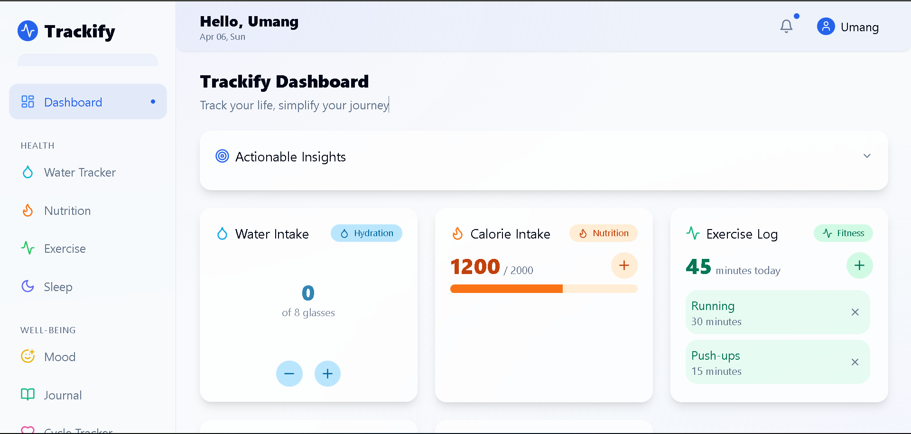
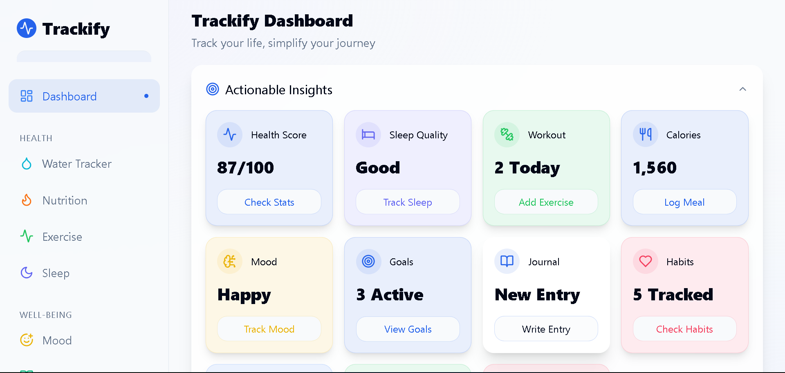
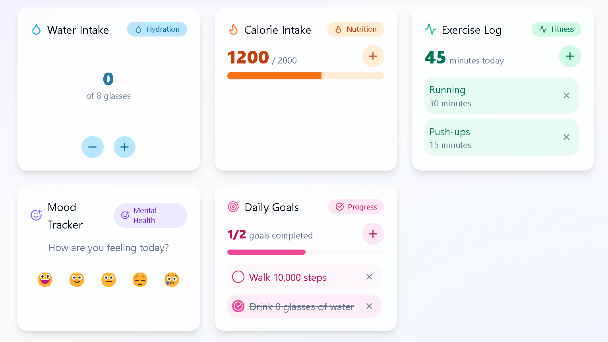
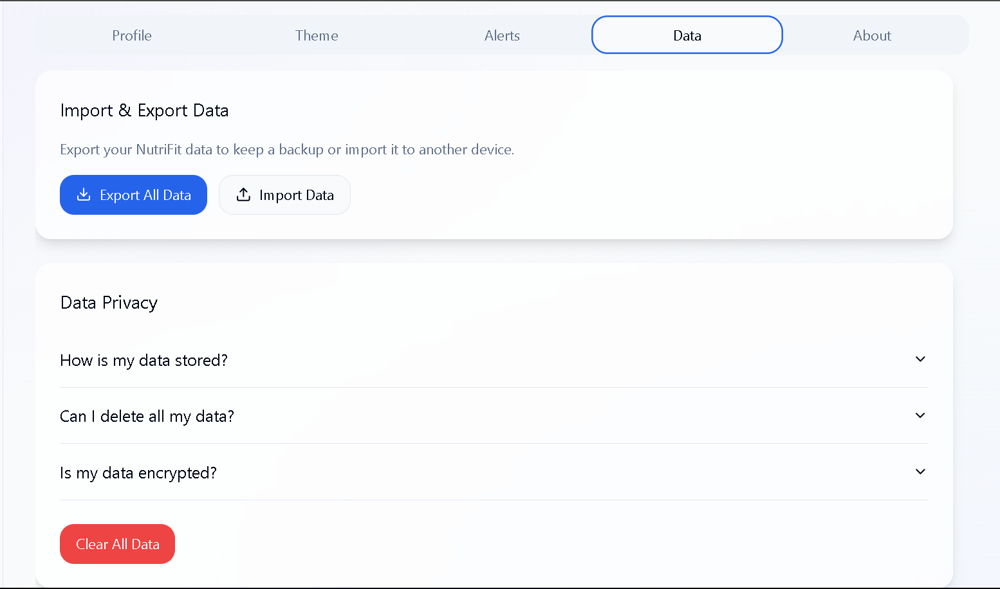

# Trackify - Your Daily Tracking Companion



## 🌟 Overview

Trackify is a comprehensive health and fitness tracking application designed to help users monitor and improve their wellness journey. The application provides an intuitive dashboard that centralizes various tracking features, helping you stay on top of your health and fitness goals.

## 💧 Trackify - Features

### Features Overview
Trackify offers a wide range of features to help you manage and improve your daily habits and overall wellness. Here’s a comprehensive list of what you can track and manage:

#### Core Tracking
*   **💧 Water Tracker**: Log your daily water intake to stay hydrated.
*   **😊 Mood Tracker**: Record your daily mood to monitor your emotional well-being.
*   **💤 Sleep Tracker**: Track your sleep duration and patterns to improve sleep quality.
*   **🍎 Nutrition Tracker**: Monitor your caloric intake, log meals, and plan your nutrition.
*   **🏋️ Exercise Tracker**: Log and analyze your workout sessions and physical activities.

#### Specialized Tracking
*   **🌸 Cycle Tracker**: Track your menstrual cycle, symptoms, and related health data.
*   **✍️ Journal**: Maintain a personal journal to record thoughts, feelings, and daily reflections.
*   **✅ Habit Tracker**: Set and track daily and weekly habits to build positive routines.
*   **🎯 Goals Tracker**: Define and track your personal health and wellness objectives.
<!-- GitAds-Verify: OPIGWXGTEILFL2PIKERJDS9E41DHPDR1 -->
#### Additional Features
*   **🔔 Reminders and Notifications**: Set custom reminders to help you stay consistent with your tracking.
*   **🎨 Customizable Dashboard**: Personalize your dashboard by choosing which metrics to display.
*   **🏆 Gamification**: Stay motivated with gamified elements, including streaks and achievements.
*   **👤 User Profiles**: Create and manage detailed user profiles, including personal goals and preferences.

## 🖥️ Screenshots

### Dashboard Overview


### Trackers Card


### Setting View


## 🛠️ Technologies Used

- **Frontend**: React, TypeScript
- **Styling**: Tailwind CSS, shadcn/ui
- **State Management**: React Query
- **Routing**: React Router
- **Data Visualization**: Recharts
- **Icons**: Lucide React

## 🚀 Getting Started

### Prerequisites

- Node.js & npm installed - [install with nvm](https://github.com/nvm-sh/nvm#installing-and-updating)

### Installation

```bash
# Clone the repository
git clone https://github.com/mini-page/trackify.git

# Navigate to the project directory
cd trackify

# Install dependencies
npm install

# Start the development server
npm run dev
```

## 📱 **Responsive Design**

Trackify ensures a seamless experience across all devices! Whether you're on a **desktop**, **tablet**, or **mobile**, Trackify adjusts beautifully to any screen size, providing a smooth, responsive interface that looks great on all platforms. 📱💻📲

## 👤 **Created By**

This project was lovingly crafted with 💖 by **Umang**, also known as **mini-page** and **Raghav**. From sketching the wireframes to writing the code, every line is a labor of passion and creativity. ✨🚀

## 📄 **License**

Trackify is open source and proudly licensed under the **MIT License**. Feel free to use, modify, and share — for more details, check out the LICENSE file. Let’s keep the open-source spirit alive! 🙌🔓

## 🤝 Contributing

Contributions are welcome! If you have suggestions or improvements, feel free to fork the repository and submit a pull request. Please ensure your code adheres to the project's coding standards.

To contribute:

1. Fork the repository
2. Create your feature branch (`git checkout -b feature/YourFeature`)
3. Commit your changes (`git commit -m 'Add some YourFeature'`)
4. Push to the branch (`git push origin feature/YourFeature`)
5. Open a pull request
